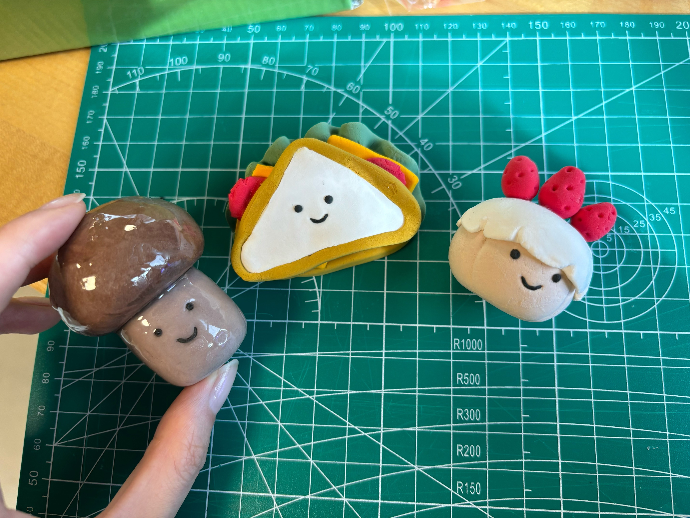

# Airydryclay

##   Preparation:
- Ai-dry Clay
- Mat
- Modeling tools
- Ziplock bags

    

##   Shaping
- Take out the clay
- Use a ziplock bag to seal the excess clay to prevent it from drying out.
    

- Use your hands or a board to knead and roll it into a ball. (Using a board can reduce fingerprints)
    
    
    
    
- Knead or roll it into a cylinder.
    
    

- Press down on the cylinder to adjust its height, making the top and bottom surfaces of the cylinder flat.

    
    

- Adjust the shape
    

##  Assemble
- Score the top side with a needle tool or fork （this can make the two parts stick together more tightly.）

    

- Connect the two parts together.
    

##  Make details

- Use a tool to drill small hole to make eyes and a mouth.
    

- 

